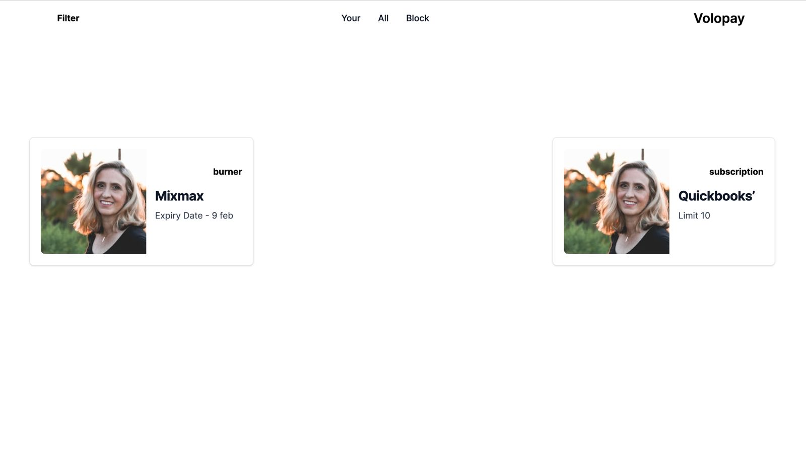

# Volopay Assignment

STEPS TO ACCESS THE PROJECT:
1. The first and foremost step to run this project, you have to run the command npm install.

2. Run the command npm run dev, from which the project will start into development mode.

3. Then, further our project will build to run in the development mode for production usage using the command yarn run build.

4. Further, using the command yarn run start, our project will get started at the server.

* The following assignment consists of a frontend application using React. Where I have created a web application which is user friendly in which user can decide it's status whether it is active or inactive depending on the card type, i.e. either BURNER or SUBSCRIPTION.
* We have also designed a JSON structured API, which includes all the necessary details required for the card type, and to know which one is running depending on the owner_id.

The navbar of my application consists of 3 tabs which are-
1. YOUR-
In the 'your' page we are showing the recent active card of the user, which is currently working.

2. ALL-
In the 'all' page we are showing all cards which are available i.e. either burner or subscription and user can choose any one depending on their choice.

3. BLOCKED-
In the 'blocked' page further, the cards that will be blocked, or get expired will be displayed.

* The user can filter by card type as well, depending upon the type i.e. either burner or subscription.

